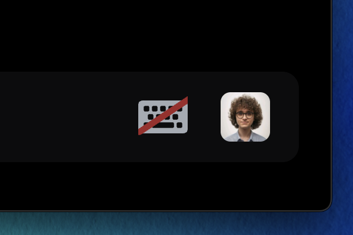

# Awesome CSS &nbsp; [](https://github.com/AushevAhmad/awesome-css/pulls) [](https://github.com/AushevAhmad/awesome-css/main/LICENSE.md) 
A collection of awesome CSS snippets for Discord. See [Installing Modules](#installing-modules) for help getting started.


## Modules


### 🍸 Bartender 
Hide Discord's toolbar icons until you need them. 
```css
@import url("https://raw.githubusercontent.com/AushevAhmad/awesome-css/main/modules/bartender.css");
```


### 🙂 Custom Emoji 
Replace the emoji icon in text inputs with one of your choice. 
```css
:root {
    --image-link: url("https://cdn.discordapp.com/emojis/1196313509525471355.webp");
}
@import url("https://raw.githubusercontent.com/AushevAhmad/awesome-css/main/modules/custom-emoji-bar.css");
```


### ⌨️ Custom Prompt 
Replace the text prompt in the chat bar. 
```css
:root {
    --prompt-text: "be silly :3";
}
@import url("https://raw.githubusercontent.com/AushevAhmad/awesome-css/main/modules/custom-bar-prompt.css");
```


### 📶 MemberCount Tweak 
Minor adjustments to the membercount view. *This module has no effect unless the [Vencord MemberCount](https://vencord.dev/plugins/MemberCount) plugin is installed.*
```css
@import url("https://raw.githubusercontent.com/AushevAhmad/awesome-css/main/modules/custom-bar-.css");
```


### 🛑 Adblock
Block Discord Nitro/Shop/Server Boost ads.
```css
@import url("https://raw.githubusercontent.com/AushevAhmad/awesome-css/main/modules/adblock.css");
```


### 🛡️ Adblock+ 
Better version of Adblock module that removes billing settings and profile effect.
```css
@import url("https://raw.githubusercontent.com/AushevAhmad/awesome-css/main/modules/adblockplus.css");
```

### 🧹 Declutter 
Remove useless buttons and give Discord a cleaner look.
```css
@import url("https://raw.githubusercontent.com/AushevAhmad/awesome-css/main/modules/declutter.css");
```

### ✨ Declutter+ 
Better version of Declutter module that also removes ads by default.(Recommended)
```css
@import url("https://raw.githubusercontent.com/AushevAhmad/awesome-css/main/modules/declutterplus.css");
```


# Modules from other developers 
### 💡 Connection glow on hover by [Vortex-Chaos](https://github.com/Vortex-Chaos) 
Make the connection buttons glow when hovering in discord profiles.
```css
@import url('https://raw.githubusercontent.com/Vortex-Chaos/Discord-Connections-Glow/main/Code.css');
```

### 🎵 Better spotify player by [Panniku](https://github.com/Panniku)
Make the spotify player look like it's from Samsung OneUI.
```css
@import url('https://raw.githubusercontent.com/Panniku/vc-snippets/main/BetterSpotifyPlayer.css');
```

### 🖼️ Acrylic pop-outs by [Skyli](https://github.com/s-k-y-l-i)
Give pop-outs such as user profiles a background blur effect.
```css
@import url('https://raw.githubusercontent.com/AushevAhmad/awesome-css/main/modules/acrylicpopup.css');
```

### 🔲 Alt text improvements by [Saltssaumure](https://github.com/Saltssaumure)
Display a 'show alt` button for any image that has alt text.
```css
@import url("https://minidiscordthemes.github.io/Snippets/AltTextImprovements/main.css");
```

### 🔎 QuickSwitch V2 by [Dablulite](https://github.com/dablulite)
A redesign to Discord's quickswitcher, making it look more like spotlight and simillar search bars.
``` css
@import url("https://dablulite.github.io/css-snippets/QuickSwitchV2/import.css");
```

### 💠 Account Details Grid by [Dablulite](https://github.com/dablulite)
A refresh to the now archived "account details columns" snippet.
``` css
@import url("https://dablulite.github.io/css-snippets/AccountDetailsGrid/import.css");
```

### 💬 Tabs V2 Home icon by [Dablulite](https://github.com/dablulite)
Replace the Discord Home icon with a modern Chats icon.
``` css
@import url("https://dablulite.github.io/css-snippets/TabsV2HomeIcon/import.css");
```

### 🎨 Hotfix for the Nitro Themes by [Dablulite](https://github.com/dablulite)
Hotfix that styles the previously unstyled areas when using Nitro Themes
``` css
@import url("https://dablulite.github.io/css-snippets/NitroThemesFix/import.css");
```

---

## Installing Modules

1. Open the CSS file for your modded discord client. We reccomend using [Vencord](https://vencord.dev) or [BetterDiscord](https://betterdiscord.app/).

    - **Vencord:** In the Vencord settings tab, make sure *Enable Custom CSS* is turned on, then select 'Open QuickCSS File'

    - **BetterDiscord:** Open the CustomCSS tab in settings.

2. Paste the CSS modules you want into the CSS file. 

3. That's it! if you experience issues, try reloading your client.

> The modules will be loaded directly from this repo, meaning they will be able to recieve updates. If you do not want to recieve updates, see [Customizing Modules](#customizing-modules)


## Customizing Modules

If you want to customize your modules:

1. Open the link found in the module's `@import` url.

2. Copy all of the CSS and paste it into your custom CSS file.

3. You can now customize any of the module's contents. *Doing this means the modules will not recieve updates from this repo.*

## Issues / Ideas

You can report your issues or ideas in GitHub's Issues tab.

---
## Credits
[Ahmad](https://github.com/AushevAhmad), [FormalSnake](https://github.com/formalsnake), [geb](https://github.com/underscoregeb).
## Third-party Devs
[Vortex-Chaos](https://github.com/Vortex-Chaos), [Panniku](https://github.com/Panniku), [Skyli](https://github.com/s-k-y-l-i), [Saltssaumure](https://github.com/Saltssaumure), [Dablulite](https://github.com/dablulite)
