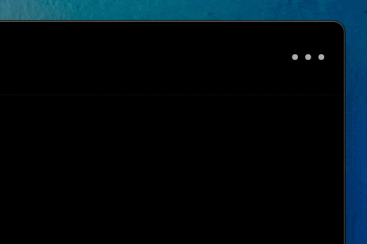
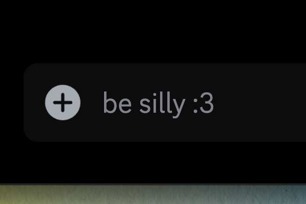
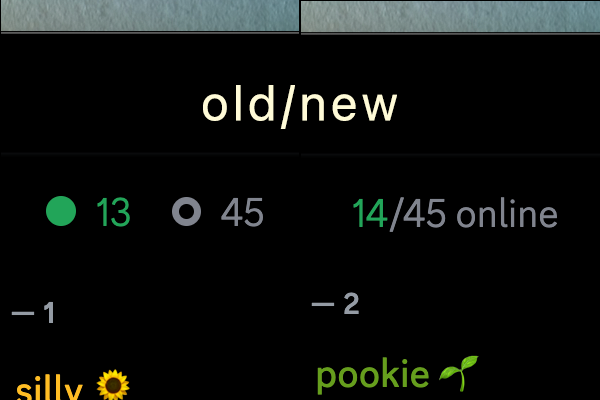
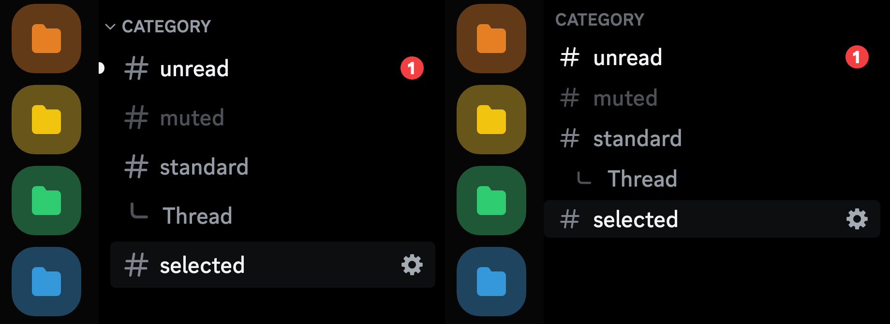
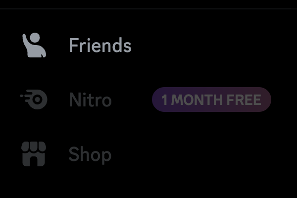
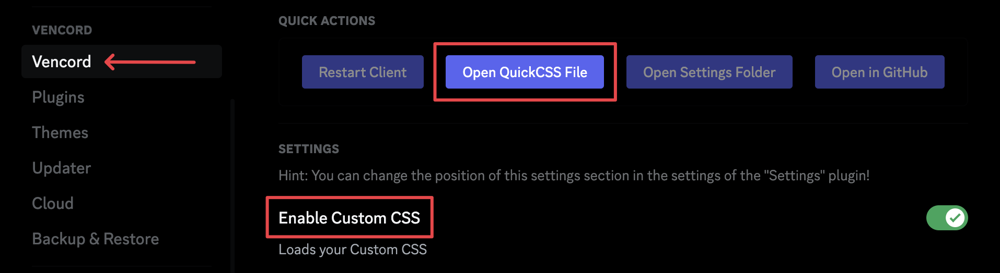
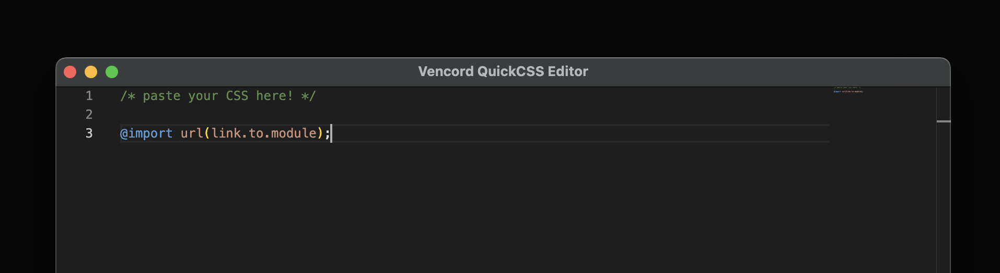

# Awesome CSS Snippets for Discord

Welcome to Awesome CSS Snippets for Discord! This repository is a curated collection of CSS snippets designed to enhance your Discord experience. Whether you want to customize the appearance, improve functionality, or streamline your usage, these snippets offer a variety of solutions.

Jump down to [Installing Modules](#installing-modules) for help getting started.

[](https://github.com/AushevAhmad/awesome-css/pulls)
[](https://github.com/AushevAhmad/awesome-css/blob/main/LICENSE.md)


## Modules Overview

Below is a list of modules available in this repository:

### 🍸 Bartender

Hide Discord's toolbar icons until you need them.

```css
@import url("https://aushevahmad.github.io/awesome-css/modules/bartender.css");

:root {
    --bartender-width: 40px;  /* Width for displayed icon. Adjust depending on your needs [Default: 40px] */
}
```



If you fancy an animated version, which slides in from the left, you can use the following:

```css
@import url("https://aushevahmad.github.io/awesome-css/modules/bartenderAnimated.css");

:root {
    --bartender-width: 34px; /* Adjust this to 34-45px based on themes [Default: 34px] */
    --animation-size: 21%; /* Adjust the width to show the whole section if necessary [default: 21%] */
}
```

### 🙂 Custom Emoji

Replace the emoji icon in text inputs with one of your choice.

```css
@import url("https://aushevahmad.github.io/awesome-css/modules/custom-emoji-bar.css");

:root {
    --image-link: url("https://cdn.discordapp.com/emojis/1196313509525471355.webp");
}
```


### ⌨️ Custom Prompt

Replace the text prompt in the chat bar.

```css
@import url("https://aushevahmad.github.io/awesome-css/modules/custom-bar-prompt.css");

:root {
    --prompt-text: "be silly :3";
}
```



### 📶 MemberCount Tweak

Minor adjustments to the membercount view. *This module has no effect unless the [Vencord MemberCount](https://vencord.dev/plugins/MemberCount) plugin is installed.*

```css
@import url("https://aushevahmad.github.io/awesome-css/modules/vc-membercount.css");
```



### 💬 Channel Tweaks

A few changes to the channel list, to increase density.

```css
@import url("https://aushevahmad.github.io/awesome-css/modules/channeltweaks.css");
```



### 🛑 Adblock

Block Discord Nitro/Shop/Server Boost ads.

```css
@import url("https://aushevahmad.github.io/awesome-css/modules/adblock.css");
```



### 🛡️ Adblock+

Better version of Adblock module that removes billing settings and profile effects.

```css
@import url("https://aushevahmad.github.io/awesome-css/modules/adblockplus.css");
```

### 🧹 Declutter

Remove useless buttons and give Discord a cleaner look.

```css
@import url("https://aushevahmad.github.io/awesome-css/modules/declutter.css");
```

### ✨ Declutter+

Better version of Declutter module that also removes ads by default. (Recommended)

```css
@import url("https://aushevahmad.github.io/awesome-css/modules/declutterplus.css");
```

## Modules from Other Developers

In addition to our modules, here are some contributions from other developers:

### 💡 Connection Glow on Hover by [Vortex-Chaos](https://github.com/Vortex-Chaos)

Make the connection buttons glow when hovering in Discord profiles.

```css
@import url("https://raw.githubusercontent.com/Vortex-Chaos/Discord-Connections-Glow/main/Code.css");
```


### 🎵 Better Spotify Player by [Panniku](https://github.com/Panniku)

Make the Spotify player look like it's from Samsung OneUI.

```css
@import url("https://raw.githubusercontent.com/Panniku/vc-snippets/main/BetterSpotifyPlayer.css");
```


### 🖼️ Acrylic Pop-outs by [Skyli](https://github.com/s-k-y-l-i)

Give pop-outs such as user profiles a background blur effect.

```css
@import url("https://aushevahmad.github.io/awesome-css/modules/acrylicpopup.css");
```


### 🔲 Alt Text Improvements by [Saltssaumure](https://github.com/Saltssaumure)

Display a 'show alt` button for any image that has alt text.

```css
@import url("https://minidiscordthemes.github.io/Snippets/AltTextImprovements/main.css");
```

### 🔎 QuickSwitch V2 by [Dablulite](https://github.com/dablulite)

A redesign to Discord's quickswitcher, making it look more like spotlight and similar search bars.


```css
@import url("https://dablulite.github.io/css-snippets/QuickSwitchV2/import.css");
```

### 💠 Account Details Grid by [Dablulite](https://github.com/dablulite)

A refresh to the now archived "account details columns" snippet.

```css
@import url("https://dablulite.github.io/css-snippets/AccountDetailsGrid/import.css");
```

### 💬 Tabs V2 Home Icon by [Dablulite](https://github.com/dablulite)

Replace the Discord Home icon with a modern Chats icon.

```css
@import url("https://dablulite.github.io/css-snippets/TabsV2HomeIcon/import.css");
```

### 🎨 Hotfix for the Nitro Themes by [Dablulite](https://github.com/dablulite)

Hotfix that styles the previously unstyled areas when using Nitro Themes.

```css
@import url("https://dablulite.github.io/css-snippets/NitroThemesFix/import.css");
```

## Installing Modules

To install these modules:

1. Open the CSS file for your modded Discord client. We recommend using [Vencord](https://vencord.dev) or [BetterDiscord](https://betterdiscord.app/).

   - **Vencord:** In the Vencord settings tab, ensure *Enable Custom CSS* is turned on, then select 'Open QuickCSS File'.

   - **BetterDiscord:** Open the CustomCSS tab in settings.

2. Paste the CSS modules you want into the CSS file.

3. That's it! If you experience issues, try reloading your client.

If you prefer not to receive updates, see [Customizing Modules](#customizing-modules).





## Customizing Modules

If you would like to to customize your modules:

1. Open the link found in the module's `@import` URL.

2. Copy all of the CSS and paste it into your custom CSS file.

3. You can now customize any of the module's contents. *Doing this means the modules will not receive updates from this repository.*

## Issues / Ideas

If you encounter any issues or have ideas for improvement, please report them in GitHub's Issues tab.

## Credits

This project is maintained by [Ahmad](https://github.com/AushevAhmad), [FormalSnake](https://github.com/formalsnake), [geb](https://github.com/underscoregeb), and [Kami](https://github.com/senpaihunters).

## Third-party Devs

Special thanks to the following third-party developers for their contributions:

- [Vortex-Chaos](https://github.com/Vortex-Chaos)
- [Panniku](https://github.com/Panniku)
- [Skyli](https://github.com/s-k-y-l-i)
- [Saltssaumure](https://github.com/Saltssaumure)
- [Dablulite](https://github.com/dablulite)
